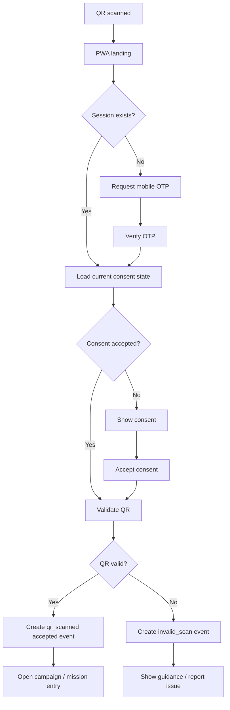

# EXPLORIA - Technical Design Pack v1.0

**وضعیت:** Official Sprint 1 Technical Baseline  
**مبنای ورودی:** BRD v1.1 + FRD v1.1 Pilot Operations Update + Product Backlog v1.0 + Sprint 0/1 Execution Plan  
**دامنه:** Sprint 1 - مسیر عملیاتی `QR Scan -> PWA -> OTP -> Consent -> Attributed Scan Event`  
**خروجی‌های همراه:** SQL DDL، OpenAPI YAML، Mermaid UI Flow  
**تاریخ:** 2026-06-19

## 1. هدف سند
این سند، طراحی فنی قابل اجرا برای Sprint 1 اکوسیستم EXPLORIA را قفل می‌کند. تمرکز این نسخه ساخت هسته فنی ورود کاربر، پیکربندی Venue و رجیستری/اعتبارسنجی QR است تا مسیر پایلوت تجاری بدون شکاف داده‌ای آغاز شود.

## 2. تصمیم‌های معماری
| کد | حوزه | تصمیم | دلیل | وضعیت |
| --- | --- | --- | --- | --- |
| ADR-001 | Frontend | PWA/Web App first; no mandatory native install in MVP/MVCP | Reduces friction after QR scan and supports field pilot. | Accepted |
| ADR-002 | Backend | REST API with JSON payloads for Sprint 1 | Fast implementation; easy admin/PWA integration. | Accepted |
| ADR-003 | Database | PostgreSQL with UUID primary keys and JSONB metadata fields | Strong relational attribution plus flexible event metadata. | Accepted |
| ADR-004 | Auth | Mobile OTP + session token; mock OTP allowed in dev/staging | Supports low-friction entry while avoiding password complexity. | Accepted |
| ADR-005 | Events | Append-only event_log foundation from Sprint 1 | Prevents analytics redesign later and supports attribution. | Accepted |
| ADR-006 | QR | QR activation blocked until Venue + Touchpoint + Campaign binding exists | Prevents attribution gaps. | Accepted |
| ADR-007 | Connectivity | Offline/manual scan placeholder in Sprint 1, full sync hardening later | Protects pilot operations without overbuilding. | Accepted |
| ADR-008 | Consent | Versioned consent text and ConsentLog required before experience activation | Supports legal/privacy traceability. | Accepted |

## 3. دامنه ماژول‌ها
| کد | ماژول | Story Trace | Requirement Trace | خلاصه دامنه |
| --- | --- | --- | --- | --- |
| AUTH | Authentication, Consent & Low-Friction Access | US-005..US-010 | AUTH-001..AUTH-006 | ورود موبایل، OTP، Session، Consent و مسیر خطای اتصال ضعیف |
| VENUE | Venue / Zone / Hub / Touchpoint Configuration | US-011..US-016 | VENUE-001..VENUE-006 | تعریف محل، زون، هاب، تاچ‌پوینت، Media Point، Merchant Node و Venue Profile |
| QR | QR Registry, Scan Validation & Attribution Hook | US-043..US-048 | QR-001..QR-006 | شناسه یکتا، اعتبارسنجی اسکن، کنترل تکرار، خروجی چاپی و Event Hook |
| EVENT | Event Foundation & Data Dictionary | US-044, US-047 | CPL-19, CPL-20 | ثبت رویدادهای پایه برای داشبورد، Attribution و گزارش پایلوت |
| ADMIN | Admin Web Foundation | US-011..US-016, US-043..US-048 | CPL-02, CPL-05 | پنل پایه برای پیکربندی Venue، Touchpoint، QR و مشاهده Scan Log |

## 4. جریان اصلی Sprint 1

## 5. مدل داده مفهومی
| Table | Module | Purpose | Key Fields | Scope |
| --- | --- | --- | --- | --- |
| users | AUTH | کاربر بازدیدکننده یا حساب داخلی سبک | id, mobile, status, preferred_language, created_at | MVP |
| otp_requests | AUTH | درخواست، انقضا و تلاش‌های OTP | id, mobile, code_hash, expires_at, attempts, status | MVP |
| user_sessions | AUTH | نشست فعال کاربر یا Session مهمان | id, user_id, session_token_hash, device_id, expires_at | MVP |
| consent_versions | AUTH/LEGAL | متن و نسخه رضایت‌نامه | id, version, language, body, status, effective_at | MVP |
| consent_logs | AUTH/LEGAL | ثبت پذیرش رضایت توسط کاربر/جلسه | id, user_id, consent_version_id, source, accepted_at | MVP |
| venues | VENUE | مکان اصلی پایلوت: EcoPark, Eram, Milad Tower | id, code, name, status, city, profile_status | MVP+MVCP |
| zones | VENUE | زون‌های داخلی هر Venue | id, venue_id, code, name, status | MVP+MVCP |
| hubs | VENUE | هاب‌های تجربه/تجاری/غذایی/علمی | id, zone_id, hub_type, name, status | MVP+MVCP |
| touchpoints | VENUE/QR | نقاط نصب QR یا تعامل | id, hub_id, type, label, status, owner_type | MVP+MVCP |
| media_points | MEDIA | نمایشگر ثابت/کوله‌پشتی/استند | id, touchpoint_id, media_type, asset_id, status | MVCP |
| merchants | MERCHANT | کسب‌وکار مشارکت‌کننده | id, venue_id, name, package_tier, status | MVCP |
| merchant_nodes | MERCHANT | نقطه فروشگاهی متصل به هاب/تاچ‌پوینت | id, merchant_id, touchpoint_id, node_type, status | MVCP |
| campaigns | CAMPAIGN | کمپین فعال یا نمونه Treasure Hunt | id, venue_id, code, name, status, start_at, end_at | MVP+MVCP |
| qr_codes | QR | رجیستری QR یکتا و قابل چاپ | id, code, venue_id, touchpoint_id, campaign_id, destination_url, status | MVP |
| scan_events | EVENT/QR | ثبت هر اسکن معتبر/نامعتبر/تکراری | id, qr_code_id, user_id, session_id, result, risk_flag, scanned_at | MVP |
| event_log | EVENT | رویداد عمومی append-only برای Analytics | id, event_type, actor_id, venue_id, payload_json, occurred_at | MVP |
| offline_scan_queue | OFFLINE | ثبت موقت اسکن/راهنمایی در اتصال ضعیف | id, source, payload_json, sync_status, created_at | P1 |
| issue_logs | SUPPORT | خطای ورود، QR، پاداش یا گزارش میدانی | id, issue_type, severity, status, user_id, touchpoint_id | P1 |
| audit_logs | ADMIN | ثبت تغییرات ادمین و عملیات حساس | id, actor_id, action, object_type, object_id, created_at | MVP |

## 6. API Contract Summary
| Group | Method | Endpoint | Purpose | Auth | Scope |
| --- | --- | --- | --- | --- | --- |
| Auth | POST | /api/v1/auth/otp/request | درخواست OTP با شماره موبایل | No | MVP |
| Auth | POST | /api/v1/auth/otp/verify | تأیید OTP و ایجاد session | No | MVP |
| Consent | GET | /api/v1/consents/current | دریافت متن رضایت‌نامه فعال | No | MVP |
| Consent | POST | /api/v1/consents/accept | ثبت پذیرش رضایت برای user/session | User Session | MVP |
| Venue Admin | POST | /api/v1/admin/venues | ایجاد Venue | Admin | MVP+MVCP |
| Venue Admin | POST | /api/v1/admin/venues/{venueId}/zones | ایجاد Zone | Admin | MVP+MVCP |
| Venue Admin | POST | /api/v1/admin/zones/{zoneId}/hubs | ایجاد Hub | Admin | MVP+MVCP |
| Touchpoint Admin | POST | /api/v1/admin/touchpoints | ایجاد Touchpoint | Admin | MVP+MVCP |
| QR Admin | POST | /api/v1/admin/qr-codes | ایجاد QR و bind به Venue/Touchpoint/Campaign | Admin | MVP |
| QR Admin | GET | /api/v1/admin/qr-codes/export | خروجی لیست QR برای چاپ/نصب | Admin | P1 |
| Scan | POST | /api/v1/scan/{qrCode} | ثبت اسکن و دریافت مقصد/وضعیت | No/User Session | MVP |
| Events | GET | /api/v1/admin/events/scan-log | مشاهده Scan Log پایه | Admin | MVP |
| Support | POST | /api/v1/issues | ثبت خطا/مشکل کاربر یا سفیر | No/User Session | P1 |

## 7. Event Dictionary
| Event | Domain | Trigger | Required Payload | Trace |
| --- | --- | --- | --- | --- |
| otp_requested | AUTH | وقتی کاربر درخواست OTP می‌دهد | mobile_hash, channel, request_id, source_qr_code | AUTH-001 |
| otp_verified | AUTH | وقتی OTP موفق تأیید می‌شود | user_id, session_id, mobile_hash, result | AUTH-001 |
| consent_viewed | CONSENT | نمایش متن رضایت‌نامه | consent_version_id, source, venue_id | AUTH-002 |
| consent_accepted | CONSENT | پذیرش رضایت توسط کاربر/جلسه | user_id, consent_version_id, accepted_at | AUTH-002 |
| venue_created | VENUE | ایجاد Venue توسط ادمین | venue_id, code, status | VENUE-001 |
| touchpoint_created | VENUE | ایجاد Touchpoint | touchpoint_id, hub_id, type, status | VENUE-003 |
| qr_created | QR | ایجاد QR در رجیستری | qr_code_id, venue_id, touchpoint_id, campaign_id | QR-001 |
| qr_scanned | QR | هر اسکن موفق یا ناموفق QR | qr_code_id, user_id/session_id, result, risk_flag, venue_id, touchpoint_id | QR-002 |
| invalid_scan | QR/FRAUD | اسکن QR غیرفعال/منقضی/خارج از Rule | qr_code_id, reason, ip_hash, device_id | QR-003 |
| duplicate_scan_flagged | QR/FRAUD | تشخیص اسکن تکراری یا rate-limit | qr_code_id, user_id/session_id, window, risk_score | QR-004 |
| offline_scan_queued | OFFLINE | ثبت موقت به‌دلیل اتصال ضعیف | source, payload_hash, sync_status | QR-005 |
| issue_reported | SUPPORT | گزارش خطا/مشکل | issue_type, severity, touchpoint_id, user_id/session_id | AUTH-005 |

## 8. UI / UX Flows
| Flow | Steps | Trace | Notes |
| --- | --- | --- | --- |
| Visitor Flow | QR Scan -> PWA Landing -> OTP Request -> OTP Verify -> Consent -> Scan Result / Campaign Entry | US-005..US-008, US-043..US-046 | بدون نصب اجباری؛ ثبت scan_event و consent_log الزامی است. |
| Admin Venue Flow | Login -> Venue -> Zone -> Hub -> Touchpoint -> Media/Merchant Node -> Activate | US-011..US-016 | Venue/Touchpoint بدون status فعال نباید برای QR عملیاتی استفاده شود. |
| Admin QR Flow | Campaign Select -> QR Create -> Bind to Touchpoint -> Validate -> Export Printable QR -> Install Checklist | US-043..US-048 | فعال‌سازی QR تا تکمیل venue_id, touchpoint_id, campaign_id بلاک می‌شود. |
| Ambassador Fallback Flow | User Error -> Guidance Screen -> Issue Log / Offline Queue -> Sync / Admin Follow-up | US-009, US-047 | نسخه اولیه فقط placeholder و ثبت خطا/راهنمایی است؛ sync کامل در اسپرینت‌های بعدی. |

## 9. Permission Matrix
| Role | Allowed | Blocked | Data Exposure |
| --- | --- | --- | --- |
| Visitor | PWA scan, OTP, consent, issue report | No admin access | mobile/session only |
| Guest Session | scan before login, landing view | No reward redemption without consent/login | anonymous session id |
| Ambassador | Guidance, issue report, optional manual/offline log | No merchant/revenue data | role-limited |
| Admin Operator | Venue/Zone/Hub/Touchpoint/QR CRUD | Cannot change revenue contracts or legal text | RBAC required |
| Campaign Manager | Campaign and QR binding, content status view | Cannot access raw mobile numbers | aggregated data |
| Data Analyst | Scan/Event/KPI read | No PII export by default | masked identifiers |
| System Admin | RBAC, audit, configuration | All sensitive actions audited | full audit trail |

## 10. Validation & Business Rules
| Rule ID | Rule | Implementation Control | Trace |
| --- | --- | --- | --- |
| VR-001 | QR فعال نمی‌شود مگر venue_id، touchpoint_id و campaign_id معتبر داشته باشد. | Backend validation + admin UI required fields | QR-001 |
| VR-002 | ConsentLog باید consent_version_id، source و accepted_at داشته باشد. | Database not-null + API check | AUTH-002 |
| VR-003 | OTP پس از انقضا یا پس از تعداد تلاش مجاز رد می‌شود. | expires_at + attempt limit | AUTH-004 |
| VR-004 | اسکن تکراری در بازه زمانی مشخص risk_flag می‌گیرد یا Progress ایجاد نمی‌کند. | Duplicate/rate-limit rule | QR-004 |
| VR-005 | ScanEvent باید به QR، Venue، Touchpoint و زمان ثبت متصل باشد. | Event schema required fields | QR-002 |
| VR-006 | گزارش عمومی یا Merchant View نباید mobile خام نمایش دهد. | Masking + access policy | CPL-18 |
| VR-007 | Milad Tower تا تکمیل Venue Profile با status=Placeholder باقی می‌ماند. | Seed data rule | VENUE-001 |
| VR-008 | Offline/manual logs باید sync_status داشته باشند و با رویداد اصلی اشتباه نشوند. | queue table + sync state | QR-005 |

## 11. Test / UAT Scenarios
| TC ID | Scenario | Precondition | Expected Result | Priority |
| --- | --- | --- | --- | --- |
| TC-001 | QR -> PWA -> OTP -> Consent -> ScanEvent | اسکن QR فعال توسط کاربر جدید | session ایجاد شود، consent ثبت شود، qr_scanned با result=accepted ثبت شود | P0 |
| TC-002 | Invalid QR | اسکن QR غیرفعال یا منقضی | پیام مناسب نمایش داده شود و invalid_scan ثبت شود | P0 |
| TC-003 | Duplicate Scan | اسکن تکراری همان QR در بازه کوتاه | risk_flag یا duplicate_scan_flagged ثبت شود | P0 |
| TC-004 | Venue Admin | ایجاد Venue، Zone، Hub و Touchpoint | ساختار مکانی بدون خطا ایجاد و قابل انتخاب در QR باشد | P0 |
| TC-005 | QR Admin Export | ایجاد QR و خروجی چاپی | QR با label محل نصب و status قابل export باشد | P1 |
| TC-006 | Consent Version | تغییر نسخه رضایت‌نامه | پذیرش جدید به نسخه جدید وصل شود و تاریخ ثبت شود | P0 |
| TC-007 | Weak Connectivity Placeholder | خطای ورود یا اسکن در اتصال ضعیف | Issue/Offline Log ایجاد شود و کاربر پیام راهنما ببیند | P1 |
| TC-008 | PII Masking | مشاهده Scan Log توسط نقش تحلیلگر | موبایل خام نمایش داده نشود | P0 |

## 12. Open Decisions
| ID | Decision | Question | Owner | Due |
| --- | --- | --- | --- | --- |
| OD-001 | OTP provider | انتخاب ارائه‌دهنده OTP/SMS و هزینه هر پیام | Owner + Tech Lead | Sprint 0/early Sprint 1 |
| OD-002 | Legal consent copy | متن نهایی رضایت‌نامه و حریم خصوصی برای پایلوت | Owner + Legal | Before UAT |
| OD-003 | QR print format | ابعاد، طراحی، URL format و لوگوی QRهای نصب‌شده | Ops + Brand + Tech | Before installation |
| OD-004 | Pilot seed venues | لیست قطعی Zone/Hub/Touchpoint برای EcoPark/Eram و placeholder برج میلاد | Operations + BA | Before Sprint 1 QA |
| OD-005 | Hosting/staging | محیط staging، دامنه PWA و تنظیمات SSL | Tech Lead/DevOps | Sprint 0 |
| OD-006 | Manual/offline policy | چه کسی اجازه ثبت دستی دارد و چه داده‌ای ثبت می‌شود | Operations + Legal | Before pilot |

## 13. Sprint 1 Exit Gate
Sprint 1 زمانی قابل قبول است که سناریوی کامل زیر در Staging بدون خطای بحرانی اجرا شود:
1. ادمین Venue/Zone/Hub/Touchpoint نمونه را تعریف کند.
2. ادمین QR را به Venue/Touchpoint/Campaign متصل کند.
3. کاربر QR را اسکن کند و بدون نصب اپلیکیشن وارد PWA شود.
4. کاربر OTP را دریافت و تأیید کند.
5. ConsentLog با نسخه رضایت‌نامه ثبت شود.
6. ScanEvent و EventLog با نسبت‌دهی به QR، Venue و Touchpoint ثبت شود.
7. QR غیرفعال، منقضی یا تکراری کنترل شود.
8. Scan Log پایه در پنل ادمین قابل مشاهده باشد.

## 14. فایل‌های همراه
- `Exploria_Technical_Design_Pack_v1.0.sql`: DDL پیشنهادی PostgreSQL برای Sprint 1.
- `Exploria_OpenAPI_Sprint1_v1.0.yaml`: قرارداد اولیه API برای تیم Backend/Frontend.
- `Exploria_Sprint1_UI_Flows_v1.0.mmd`: جریان Mermaid برای مسیر اصلی کاربر.
