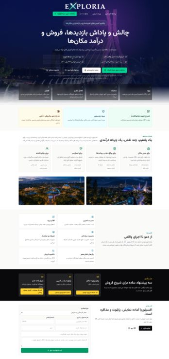
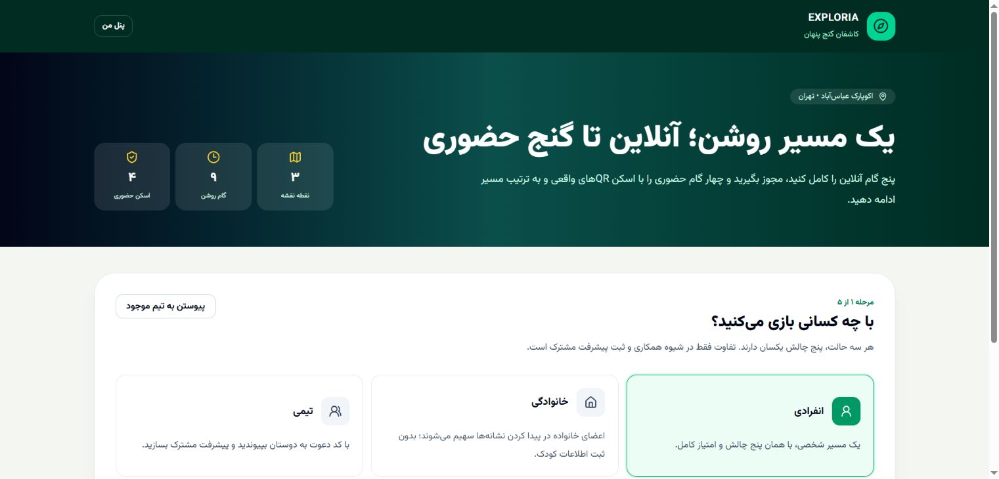
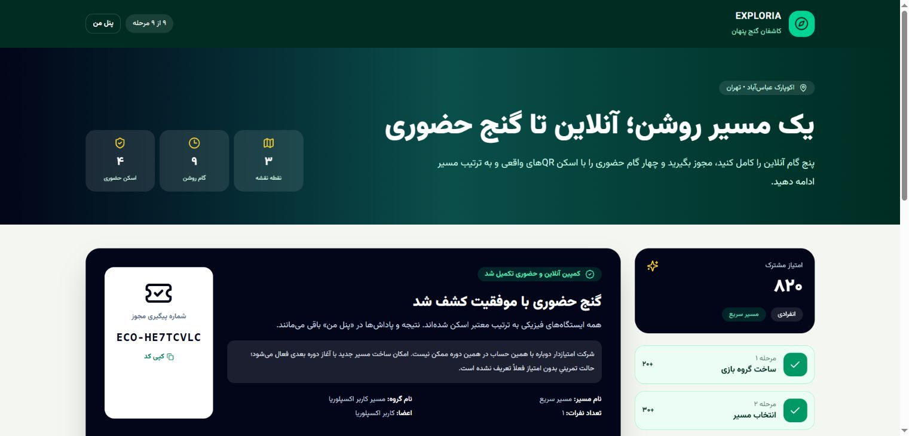
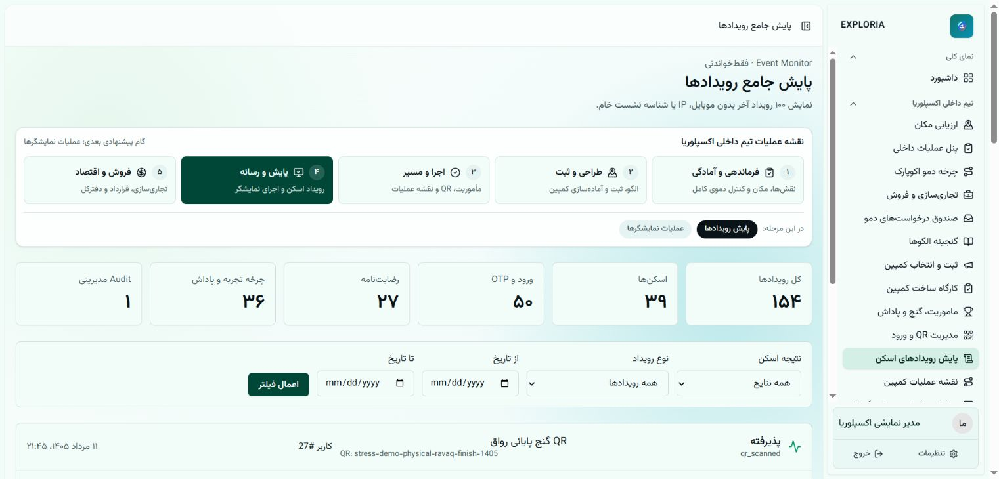
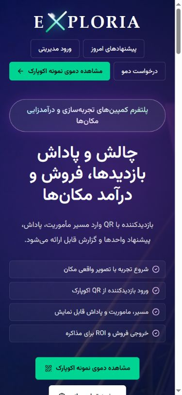
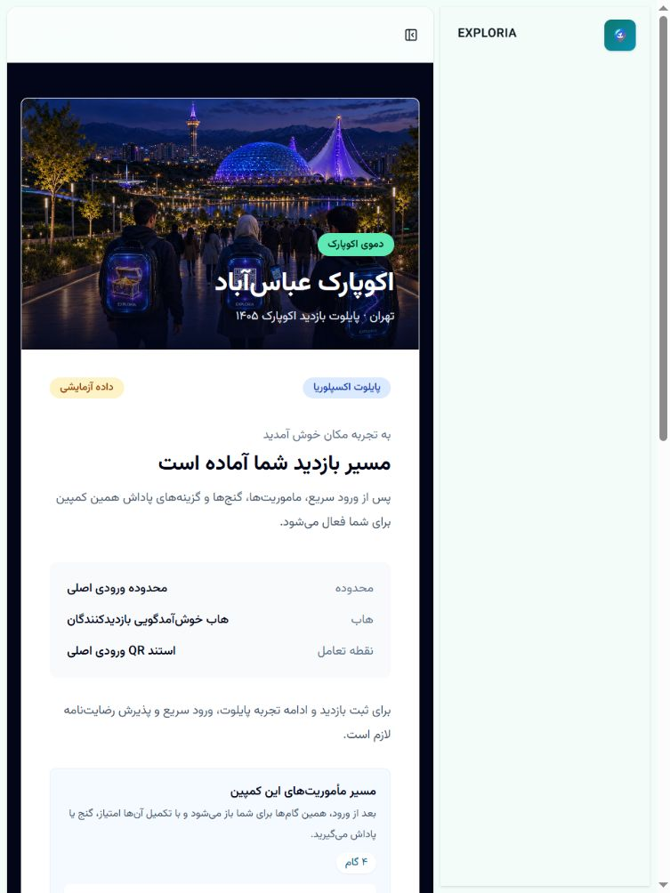

# گزارش مرحله چهارم EXPLORIA — UAT نقش‌محور و Dry Run پایلوت

- تاریخ اجرا: ۲۰۲۶-۰۸-۰۲
- محیط: Local، نشانی پایه `http://127.0.0.1:8004`
- دامنه: UAT نقش‌محور، اجرای واقعی مسیر پایلوت در مرورگر، کنترل دسترسی منفی و واکنش‌گرایی
- وضعیت نهایی: **PASS برای ادامه توسعه و نمایش پایلوت محلی**
- خارج از دامنه این مرحله: استقرار عمومی، داده واقعی، سرویس پیامک واقعی و تأیید حقوقی متن رضایت‌نامه

## نتیجه اجرایی

جریان واقعی بازدیدکننده با کلیک و ارسال فرم در مرورگر از ابتدا تا انتها اجرا شد:

`QR → OTP محلی → Consent → Visit → انتخاب انفرادی → مسیر سریع → سه کشف نقشه → رمز ۳۱۷ → مجوز حضور → دروازه حضوری → دو ایستگاه → گنج پایانی → Reward Wallet → Event Monitor`

نتیجه پایان مسیر:

- ۹ از ۹ مرحله تکمیل شد.
- ۴ از ۴ گام حضوری به ترتیب معتبر ثبت شد.
- ۸۲۰ امتیاز برای مشارکت انفرادی ثبت شد.
- ۴ پاداش در پنل مشارکت‌کننده قابل مشاهده بود.
- رویدادهای OTP، Consent، QR، مأموریت و پاداش در Event Monitor مدیر مشاهده شدند.
- شواهد بازخرید Partner در Gate تضمین کمپین موجود و تست خودکار صدور/مصرف پاداش سبز است.

## Gateهای داده و آمادگی

| Gate | نتیجه |
| --- | --- |
| Demo Readiness اکوپارک | ۱۹ PASS، صفر Warning، صفر Fail |
| Campaign Assurance با الزام شواهد اجرا | ۱۰ PASS، صفر Warning، صفر Fail |
| کمپین فعال در Scope مکان | ۲ |
| زنجیره QR حضوری | ۶ از ۶ آماده |

برای تکمیل حساب UAT منطقه‌ای، Seeder مصوب و idempotent با `php artisan db:seed --force` اجرا شد. Migration جدیدی معطل نبود.

## UAT نقش‌محور

| نقش | مقصد تأییدشده در مرورگر | نتیجه |
| --- | --- | --- |
| Admin مرکزی | `/dashboard`، `/admin/demo-cycle`، `/admin/events/scan-log` | PASS |
| Admin منطقه‌ای | `/dashboard` با Scope منطقه‌ای Seedشده | PASS |
| Viewer | `/dashboard` | PASS |
| Visitor | `/participant/dashboard` و بازی اکوپارک | PASS |
| مدیر مکان | `/venue/dashboard` | PASS |
| مدیر رواق | `/ravaq/dashboard` | PASS |
| Partner / کافه اکو | `/partner/dashboard` | PASS |
| Sponsor | `/sponsor/dashboard` | PASS |

مسیر فروشگاه رواق و مدیر پروژه علاوه بر قرارداد Seeder، در `RolePanelJourneyTest` پوشش داده شدند.

### کنترل‌های منفی

| نقش | مسیر ممنوع | پاسخ |
| --- | --- | --- |
| Partner | `/admin/access-scopes` | 403 PASS |
| Viewer | `/admin/display-operations` | 403 PASS |
| Sponsor | `/partner/dashboard` | 403 PASS |
| Sponsor | `/partner/ads` | 403 PASS |

## نقص کشف‌شده و اصلاح حداقلی

در اجرای دستی مشخص شد Visitor احراز‌شده پس از پذیرش رضایت‌نامه و اسکن QR شروع، دوباره به فرم OTP فرستاده می‌شود. علت، مقصد ثابت `/access` در صفحه Scan Landing بود.

اصلاح انجام‌شده:

- Backend مقصد ورود QR را بر اساس نقش جاری تولید می‌کند.
- Visitor احراز‌شده مستقیماً به Consent/ثبت Visit هدایت می‌شود.
- Guest همچنان وارد جریان OTP می‌شود.
- دو تست رگرسیون برای مقصد Visitor و Guest افزوده شد.
- مسیر اصلاح‌شده دوباره در مرورگر اجرا و تا ۹ از ۹ مرحله تکمیل شد.

## واکنش‌گرایی و دسترس‌پذیری پایه

| نما | صفحه | نتیجه |
| --- | --- | --- |
| Desktop پیش‌فرض | صفحه عمومی و پنل‌ها | فارسی، RTL، بدون سرریز افقی |
| Mobile با Viewport 390×844 | صفحه عمومی | فارسی، RTL، بدون سرریز افقی |
| Tablet با Viewport 768×1024 | Scan Landing | فارسی، RTL، بدون سرریز افقی |

Loading واقعی OTP و Consent، حالت 403 و پیام‌های راهنمای مسیر نیز در مرورگر مشاهده شدند. بررسی تخصصی WCAG با ابزار مستقل در دامنه این مرحله نبود.

## Verification نهایی

| کنترل | نتیجه |
| --- | --- |
| Migration | `Nothing to migrate` |
| تست‌های هدفمند UAT | ۳۵ تست، ۱۰۴۰ Assertion — PASS |
| PHPUnit کامل | ۳۶۳ تست، ۴۶۹۱ Assertion — PASS |
| PHPStan | صفر خطا |
| Pint | PASS |
| ESLint | PASS |
| Prettier | PASS |
| TypeScript | PASS |
| Production Build | ۲۳۳۹ Module، PASS |
| npm audit | صفر آسیب‌پذیری |
| Composer audit | بدون Advisory شناخته‌شده |

## شواهد تصویری

## محدودیت‌های باقی‌مانده برای اجرای واقعی

- متن Consent همچنان صریحاً نسخه آزمایشی و غیرحقوقی است و پیش از UAT عمومی باید توسط مالک محصول/مشاور حقوقی جایگزین شود.
- پیامک واقعی، دامنه عمومی، TLS، Queue/Worker، مانیتورینگ و سرویس‌های بیرونی در این Dry Run محلی آزمایش نشده‌اند.
- این PASS به معنی Production Go-Live نیست؛ مجوز ادامه توسعه، دمو و آماده‌سازی Staging/Pilot کنترل‌شده است.

## فایل‌های تغییرکرده

- `app/Http/Controllers/ScanLandingController.php`
- `resources/js/pages/scan/landing.tsx`
- `tests/Feature/Consent/ConsentFlowTest.php`
- `docs/features/UAT_CRITICAL_FLOW_EVIDENCE.md`
- `docs/features/ROLE_PANEL_UAT_CHECKLIST.md`
- `docs/uat/EXPLORIA_Stage_4_UAT_Dry_Run_v1.0.md`
- `docs/uat/evidence/stage-4/*.png`
